# Deep Long-Tailed Learning-A Survey

（ps.笔记是根据自己理解写得，若有不对的地方请私信告诉我。）

## Part 3 : CLASSIC METHODS

​		1.论文中提到的几类经典方法已经整理好，具体的分类见笔记的[Appendix](#Appendix - CLASSIC METHODS)。（每一个具体的方法都有一些标签，方便查阅）下面先简单提一下几个大类（里面的论文往往用了很多种trick，所以有一篇文章在多个类下面的情况）：

- 类别重均衡（涉及到的方法往往针对样本不均衡，希望改变一些值来直接消除这种不均衡带来的bias）：
  - 重采样（经典的一些采样策略，与模型相关的一些特殊的采样策略）
  - 改变损失函数（改变权重大小，对类别边缘分布做出限制）
  - 对分类过程中的logit做事后调整
- 信息增强：
  - 迁移学习（将头部信息迁移到尾部，做预训练，知识蒸馏，半监督之类的自训练）
  - 数据增强（这里的数据增强更侧重于是一些传统方法的数据增强，可以理解成对原始数据直接做数据增强。

- 模型提升：

  - 改进特征提取模型（度量学习，顺序学习，原型学习，迁移学习）

  - 改进分类模型

  - 改进两阶段解耦学习

  - 多个专家的集成学习

    

​		2.作者针对这些方法有一些简单的总结：

- 对于第一类的重均衡学习：
  
  - 优点：往往改动量不大比较容易，且方便部署嵌入别的模型使用；同时像一些改变loss的方法和改变logit的方法都是由严格的理论支撑的。
  
  - 缺点：并没有从本质上解决尾部类别仍是小样本这一问题，也即尾部和头部类别的信息量仍有很大差异，这也在一定程度上导致了我们往往顾此失彼（当然也与模型能力等有关），在提升尾部类别准确性时会牺牲头部类别准确率。
  

- 对于第二类信息增强：
  - 优点：从更加本质的方面，即数据信息量差异上，缓解了长尾问题，一定程度上避免了前面提到的顾此失彼的方法；同时，对于一些basic的传统数据增强方法，也是很容易部署嵌入别的模型使用。
  - 缺点：如果只是简单应用一些与类别无关的数据增强，那这样所有类别都能得到增强，反而会加剧类别不平衡；（另一方面，我觉得还有比如说像半监督学习这种，如果给的额外的未标签数据更加不平衡，那这样也是会加剧类别不均衡这一问题的）

## Appendix - CLASSIC METHODS

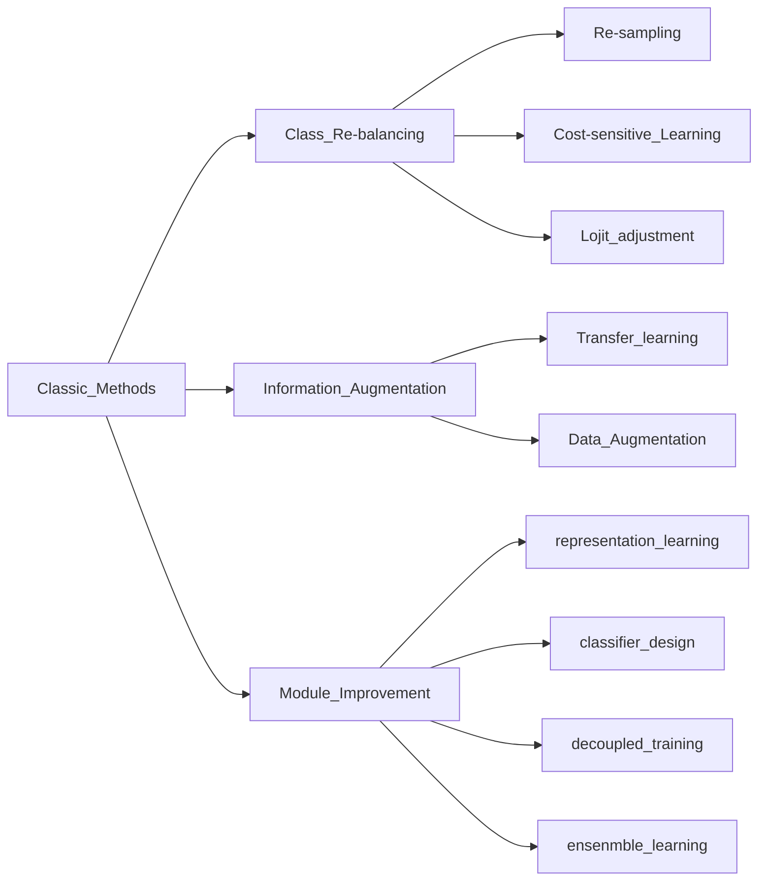
```mermaid
graph LR
	Classic_Methods --> Class_Re-balancing --> Re-sampling
	Class_Re-balancing --> Cost-sensitive_Learning
	Class_Re-balancing --> Lojit_adjustment
	Classic_Methods --> Information_Augmentation --> Transfer_learning
	Information_Augmentation --> Data_Augmentation
	Classic_Methods --> Module_Improvement --> representation_learning
	Module_Improvement --> classifier_design
	Module_Improvement --> decoupled_training
    Module_Improvement --> ensenmble_learning
```

- ### Class Re-balancing

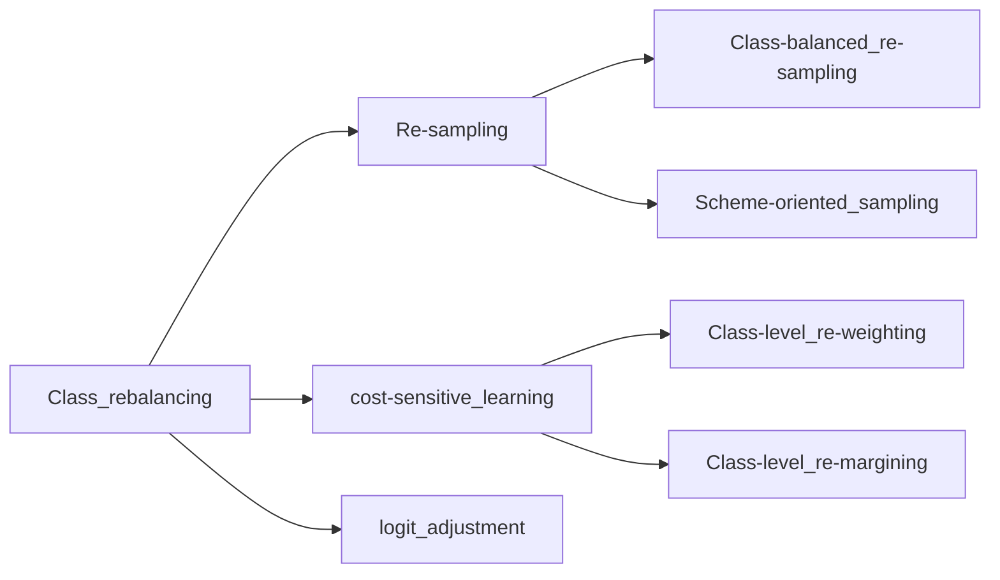
```mermaid
graph LR
	Class_rebalancing --> Re-sampling --> Class-balanced_re-sampling
	Re-sampling --> Scheme-oriented_sampling

	Class_rebalancing --> cost-sensitive_learning --> Class-level_re-weighting
	cost-sensitive_learning --> Class-level_re-margining

	Class_rebalancing --> logit_adjustment

```

- #### Re-sampling

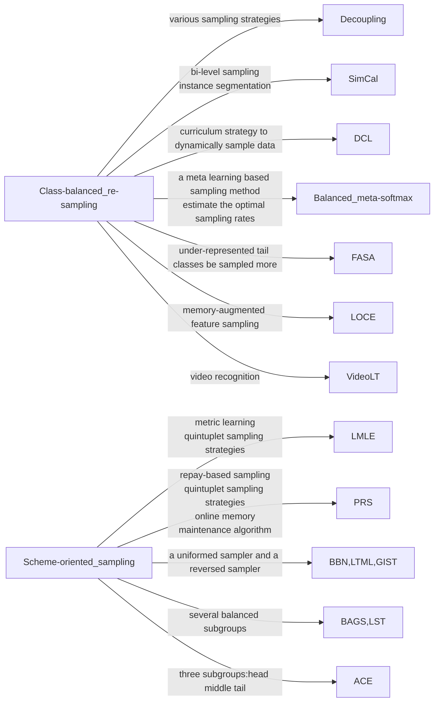
```mermaid
graph LR
	Class-balanced_re-sampling -- various sampling strategies --> Decoupling
    Class-balanced_re-sampling -- bi-level sampling<br>instance segmentation --> SimCal
    Class-balanced_re-sampling -- curriculum strategy to dynamically sample data --> DCL
    Class-balanced_re-sampling -- a meta learning based sampling method<br>estimate the optimal sampling rates --> Balanced_meta-softmax
    Class-balanced_re-sampling -- under-represented tail classes be sampled more --> FASA
    Class-balanced_re-sampling -- memory-augmented feature sampling --> LOCE
    Class-balanced_re-sampling -- video recognition --> VideoLT

	Scheme-oriented_sampling -- metric learning<br>quintuplet sampling strategies --> LMLE
	Scheme-oriented_sampling -- repay-based sampling<br>quintuplet sampling strategies<br> online memory maintenance algorithm --> PRS
	Scheme-oriented_sampling -- a uniformed sampler and a reversed sampler --> BBN,LTML,GIST
	Scheme-oriented_sampling --  several balanced subgroups --> BAGS,LST
	Scheme-oriented_sampling --  three subgroups:head middle tail --> ACE    
```

- #### cost-sensitive learning

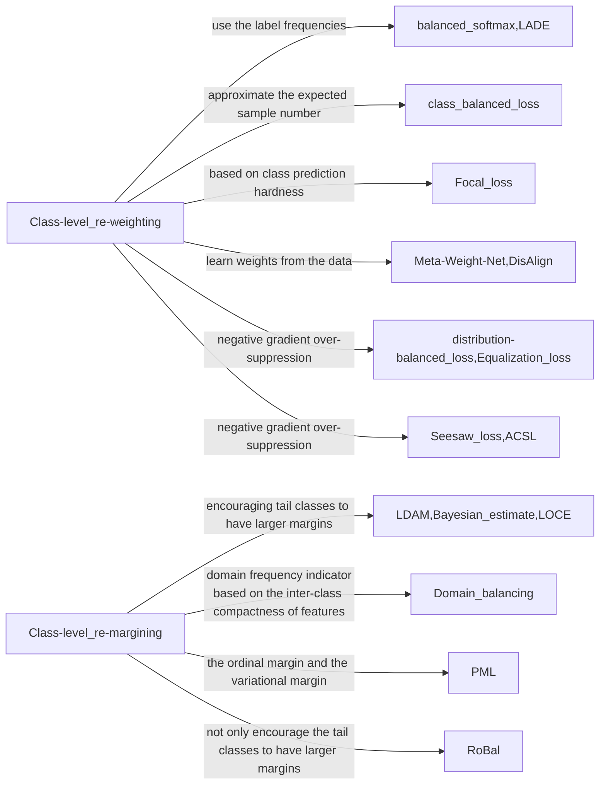
```mermaid
graph LR
	Class-level_re-weighting --  use the label frequencies --> balanced_softmax,LADE
	Class-level_re-weighting --  approximate the expected sample number --> class_balanced_loss
	Class-level_re-weighting --  based on class prediction hardness --> Focal_loss
	Class-level_re-weighting --  learn weights from the data --> Meta-Weight-Net,DisAlign
	Class-level_re-weighting --  negative gradient over-suppression--> distribution-balanced_loss,Equalization_loss
	Class-level_re-weighting --  negative gradient over-suppression-->Seesaw_loss,ACSL

	Class-level_re-margining -- encouraging tail classes to have larger margins --> LDAM,Bayesian_estimate,LOCE
	Class-level_re-margining --  domain frequency indicator<br>based on the inter-class compactness of features --> Domain_balancing
	Class-level_re-margining -- the ordinal margin and the variational margin --> PML
	Class-level_re-margining -- not only encourage the tail classes to have larger margins --> RoBal
```

- #### Logit adjustment

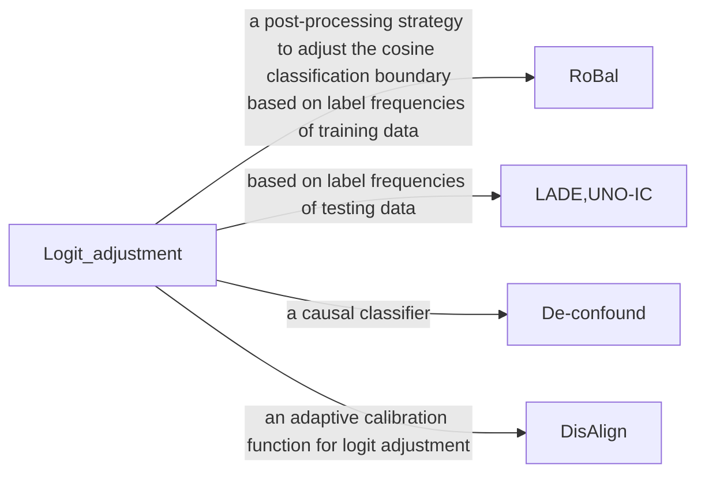
```mermaid
graph LR
	Logit_adjustment --  a post-processing strategy to adjust the cosine classification boundary<br>based on label frequencies of training data --> RoBal
	Logit_adjustment --  based on label frequencies of testing data --> LADE,UNO-IC
	Logit_adjustment -- a causal classifier --> De-confound
	Logit_adjustment --  an adaptive calibration function for logit adjustment -->  DisAlign
	
```

- ### Information augmentation

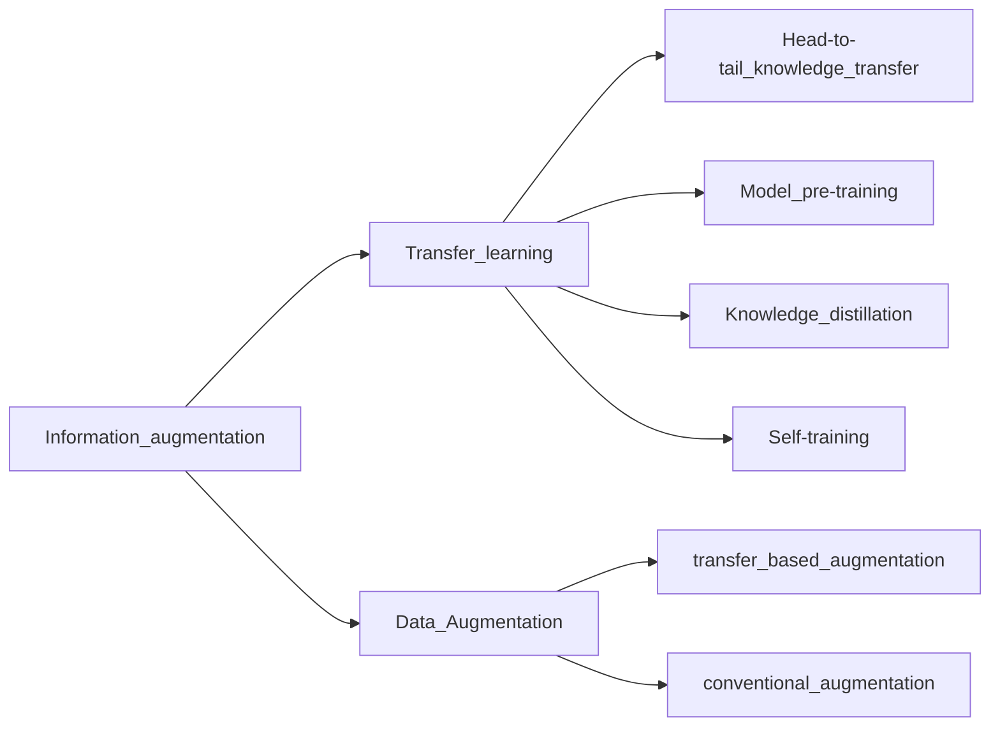
```mermaid
graph LR
	Information_augmentation --> Transfer_learning --> Head-to-tail_knowledge_transfer
	Transfer_learning --> Model_pre-training
	Transfer_learning --> Knowledge_distillation
	Transfer_learning --> Self-training
	Information_augmentation --> Data_Augmentation --> transfer_based_augmentation
	Data_Augmentation -->  conventional_augmentation

```

- #### Transfer Learning

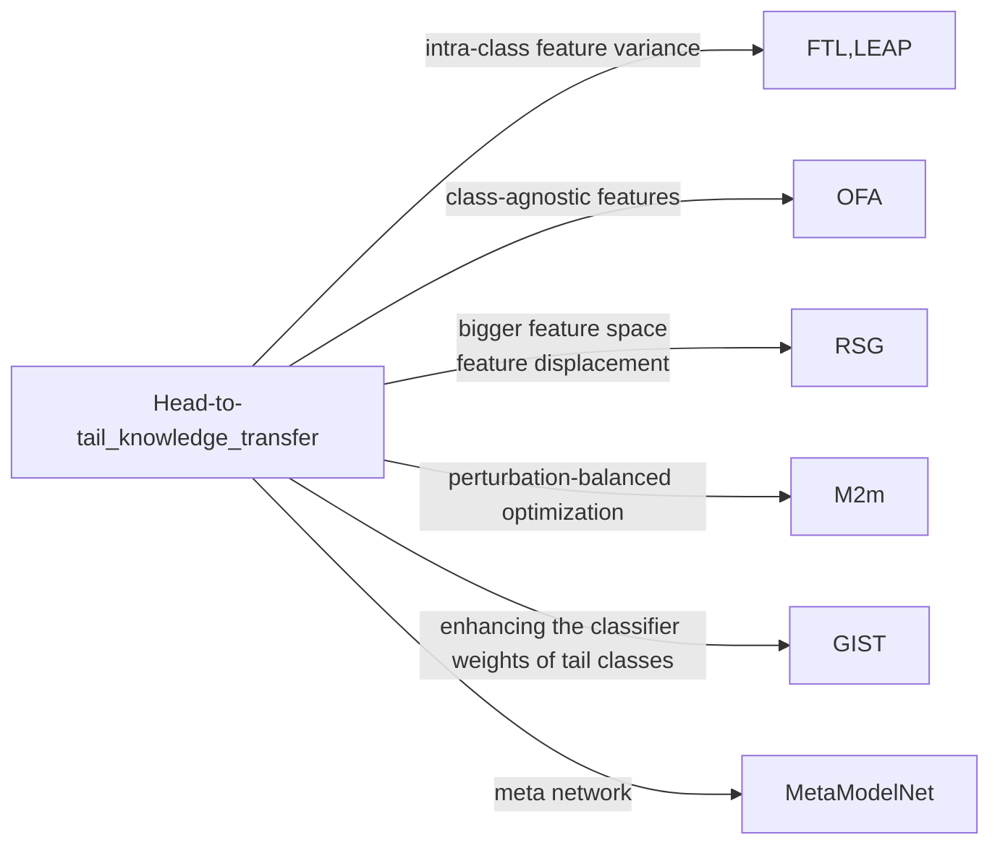
```mermaid
graph LR
	Head-to-tail_knowledge_transfer -- intra-class feature variance --> FTL,LEAP
	Head-to-tail_knowledge_transfer -- class-agnostic features --> OFA
	Head-to-tail_knowledge_transfer -- bigger feature space <br> feature displacement --> RSG
	Head-to-tail_knowledge_transfer -- perturbation-balanced optimization --> M2m
	Head-to-tail_knowledge_transfer -- enhancing the classifier weights of tail classes --> GIST
	Head-to-tail_knowledge_transfer -- meta network --> MetaModelNet		
```

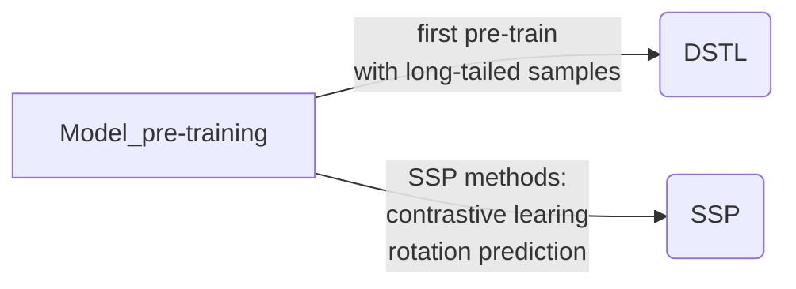
```mermaid
graph LR
	Model_pre-training -- first pre-train<br> with long-tailed samples --> Domain-specific_transfer_learning(DSTL)
    Model_pre-training -- SSP methods:<br>contrastive learing<br>rotation prediction --> self-supervised_pre-training(SSP) 

```

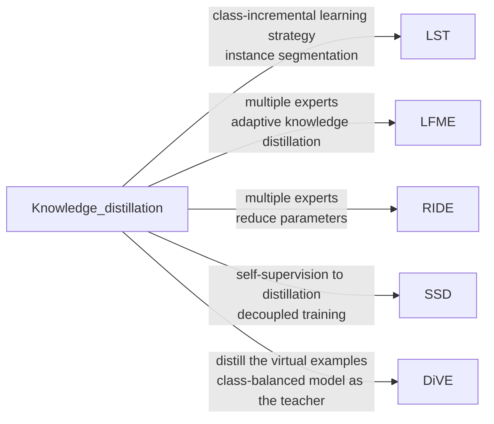
```mermaid
graph LR
	Knowledge_distillation -- class-incremental learning strategy<br>instance segmentation --> LST
    Knowledge_distillation -- multiple experts<br>adaptive knowledge distillation --> LFME
    Knowledge_distillation -- multiple experts <br> reduce parameters --> RIDE   
    Knowledge_distillation -- self-supervision to distillation<br>decoupled training --> SSD   
    Knowledge_distillation --  distill the virtual examples<br>class-balanced model as the teacher-->DiVE   
```

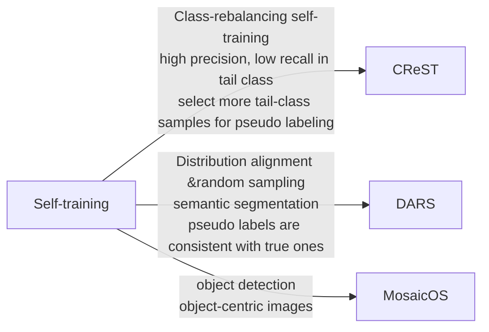
```mermaid
graph LR
	Self-training -- Class-rebalancing self-training<br>high precision, low recall in tail class<br>select more tail-class samples for pseudo labeling --> CReST
    Self-training -- Distribution alignment &random sampling<br>semantic segmentation<br>pseudo labels are consistent with true ones --> DARS
    Self-training -- object detection <br>  object-centric images --> MosaicOS
```

- #### Data Augmentation

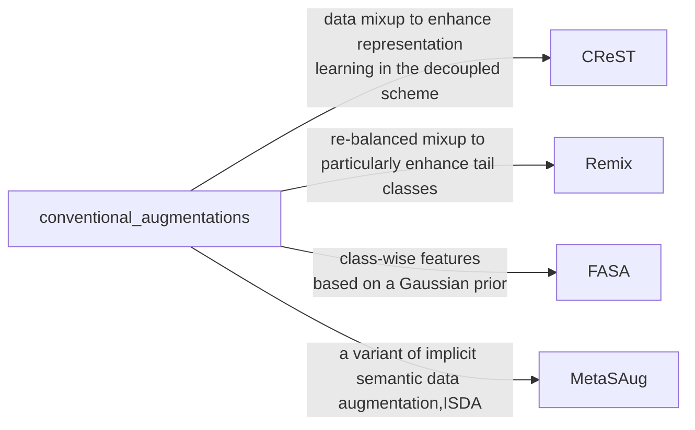
```mermaid
graph LR
	conventional_augmentations -- data mixup to enhance representation<br>learning in the decoupled scheme --> CReST
    conventional_augmentations -- re-balanced mixup to particularly enhance tail classes --> Remix
    conventional_augmentations -- class-wise features <br>  based on a Gaussian prior --> FASA
    conventional_augmentations -- a variant of implicit semantic data augmentation,ISDA --> MetaSAug

```

- ### Module improvement

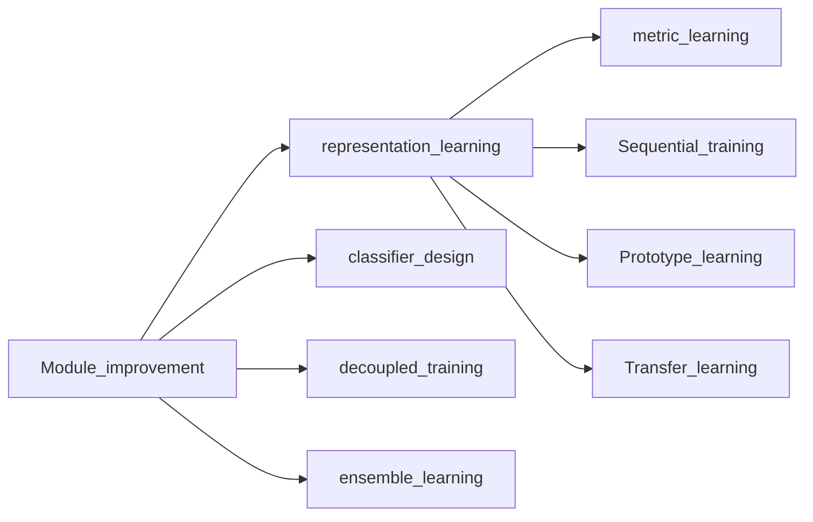
```mermaid
graph LR
	Module_improvement --> representation_learning --> metric_learning
	representation_learning --> Sequential_training
	representation_learning --> Prototype_learning
	representation_learning --> Transfer_learning
	
	Module_improvement --> classifier_design
	
	Module_improvement --> decoupled_training
	Module_improvement --> ensemble_learning
```

- ####  representation learning improves the feature extractor

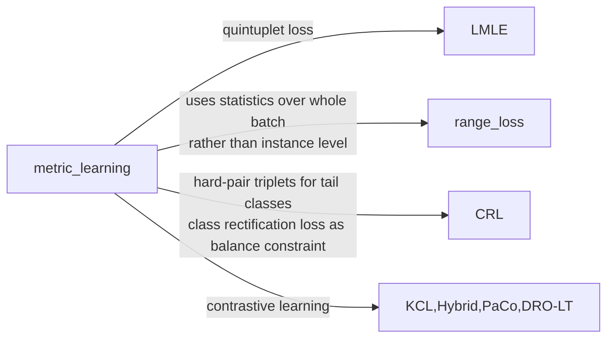
```mermaid
graph LR
	metric_learning -- quintuplet loss --> LMLE
    metric_learning --uses statistics over whole batch<br>rather than instance level --> range_loss
    metric_learning -- hard-pair triplets for tail classes<br>class rectification loss as balance constraint--> CRL
    metric_learning --contrastive learning --> KCL,Hybrid,PaCo,DRO-LT

```

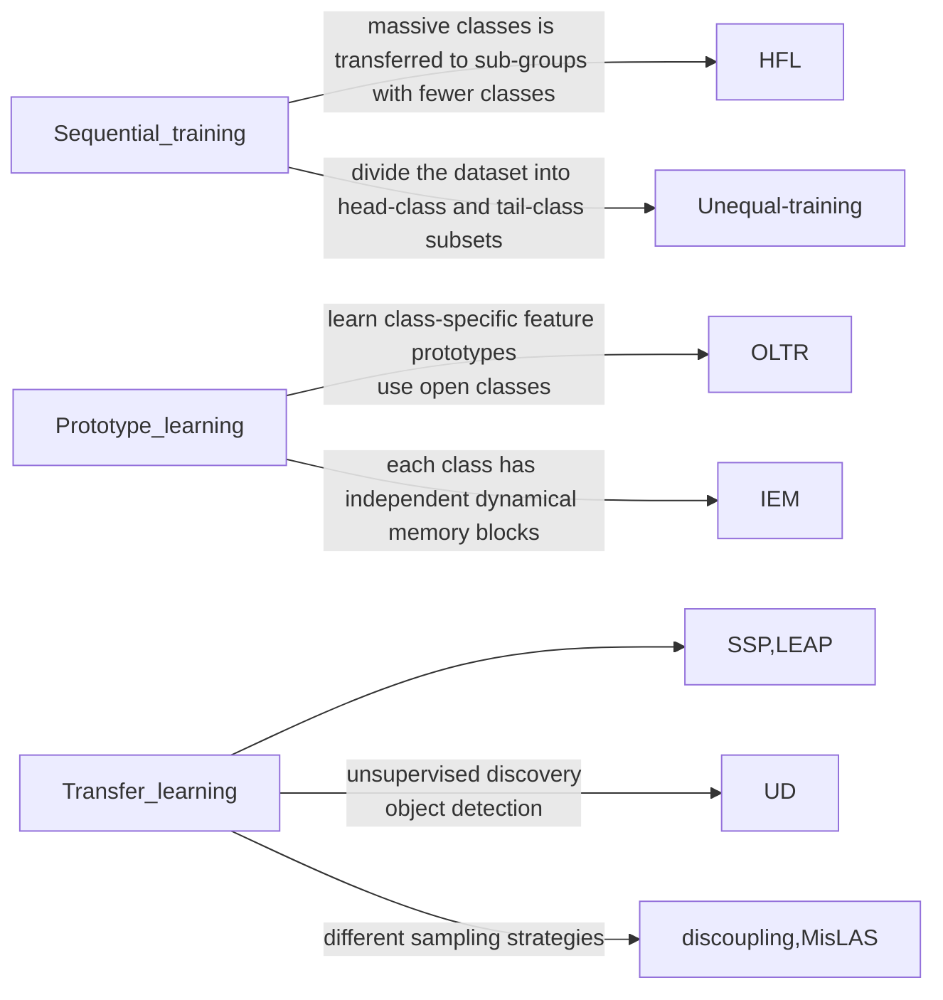
```mermaid
graph LR
	Sequential_training-- massive classes is transferred to sub-groups with fewer classes --> HFL
    Sequential_training -- divide the dataset into head-class and tail-class subsets --> Unequal-training
    
    Prototype_learning -- learn class-specific feature prototypes<br>use open classes --> OLTR
    Prototype_learning -- each class has independent dynamical memory blocks --> IEM
    
    Transfer_learning --> SSP,LEAP
    Transfer_learning -- unsupervised discovery<br>object detection --> UD
    Transfer_learning -- different sampling strategies --> discoupling,MisLAS
```

- ####  classifier design enhances the model classifier

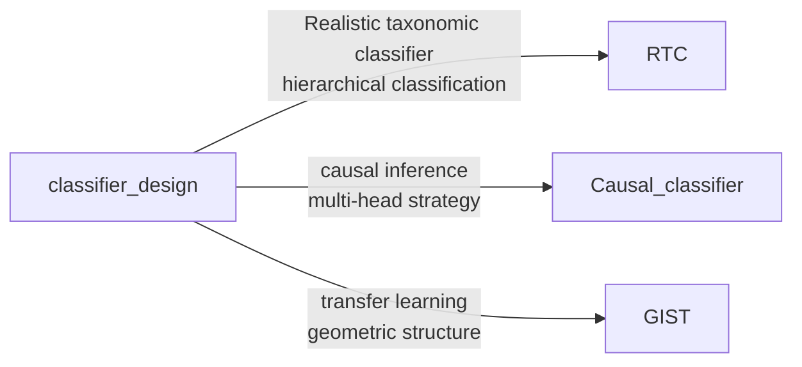
```mermaid
graph LR
	classifier_design -- Realistic taxonomic classifier<br>hierarchical classification --> RTC
    classifier_design -- causal inference<br> multi-head strategy --> Causal_classifier
    classifier_design -- transfer learning<br> geometric structure --> GIST
```

- ####  decoupled training boosts the learning of both the feature extractor and the classifier

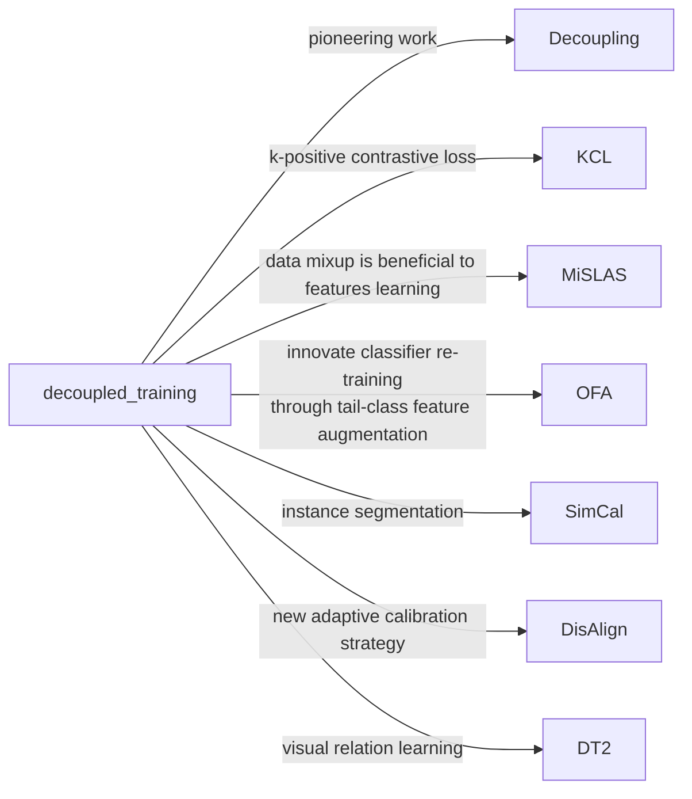
```mermaid
graph LR
	decoupled_training -- pioneering work --> Decoupling
    decoupled_training -- k-positive contrastive loss -->  KCL
    decoupled_training -- data mixup is beneficial to features learning --> MiSLAS
    decoupled_training --  innovate classifier re-training<br>through tail-class feature augmentation --> OFA
    decoupled_training -- instance segmentation --> SimCal
    decoupled_training --  new adaptive calibration strategy --> DisAlign
    decoupled_training -- visual relation learning --> DT2

```

- #### ensemble learning improves the whole architecture

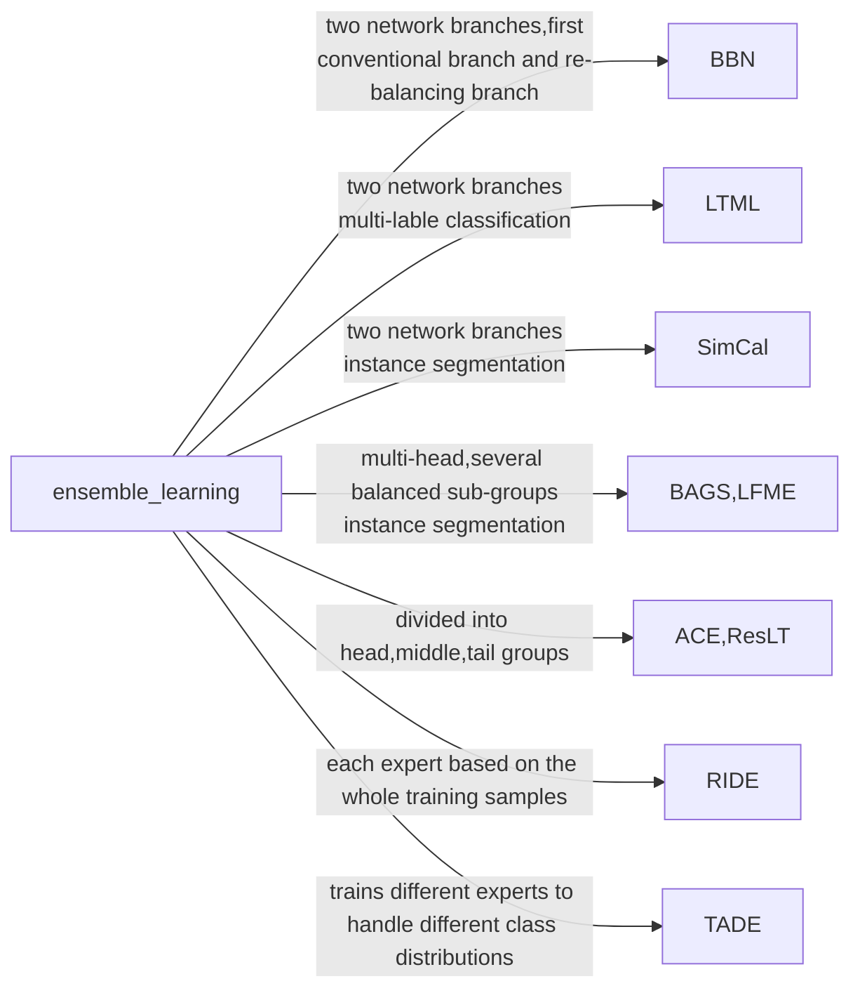
```mermaid
graph LR
	ensemble_learning --  two network branches,first<br>conventional branch and re-balancing branch --> BBN
	ensemble_learning --  two network branches<br>multi-lable classification --> LTML
	ensemble_learning --  two network branches<br>instance segmentation --> SimCal
	
	ensemble_learning --  multi-head,several balanced sub-groups<br>instance segmentation --> BAGS,LFME
	ensemble_learning --  divided into head,middle,tail groups --> ACE,ResLT
	ensemble_learning --  each expert based on the whole training samples --> RIDE
	ensemble_learning --   trains different experts to handle different class distributions --> TADE
```
